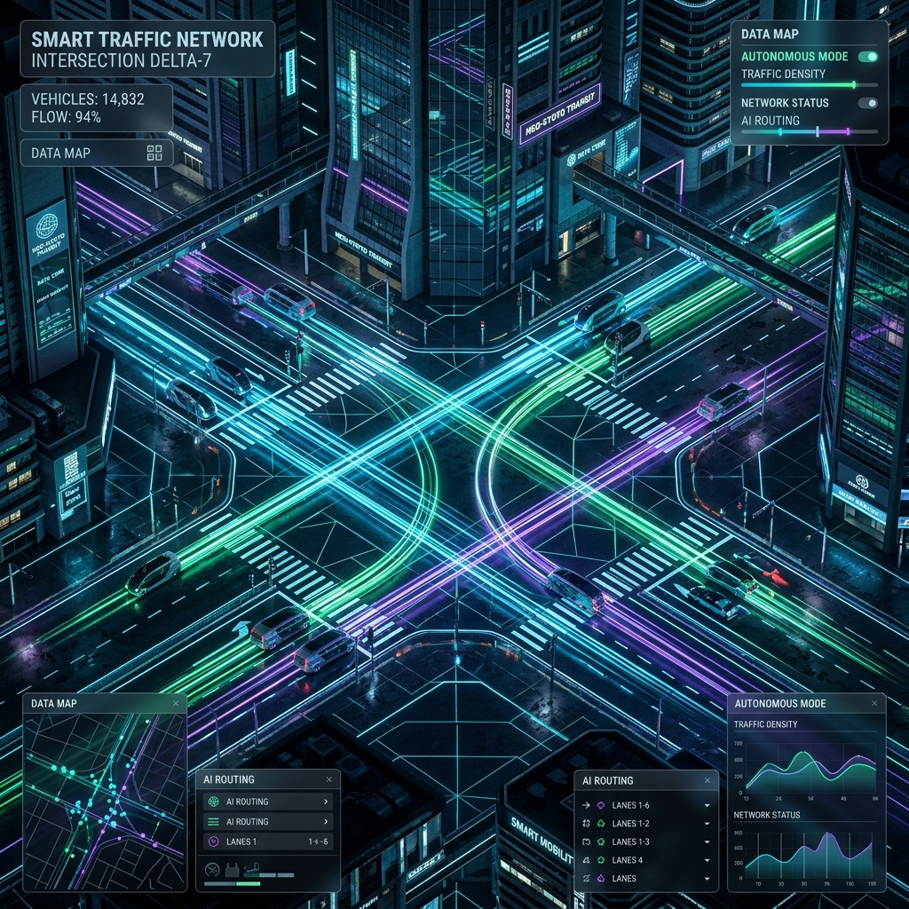
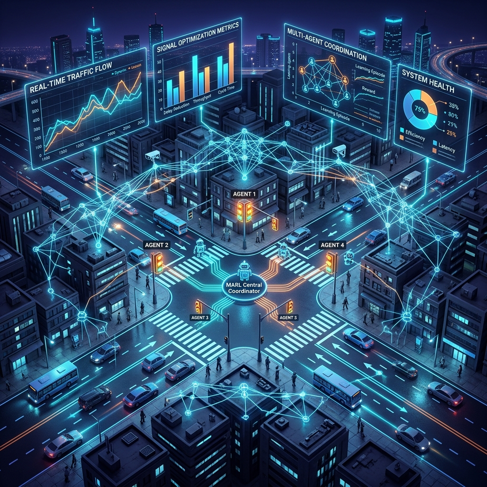
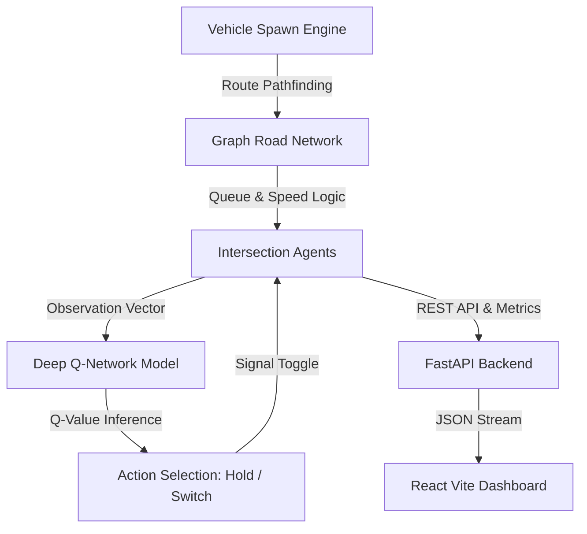

<div align="center">

# 🚦 Smart Multi-Agent Traffic Management System

[](https://python.org)
[](https://pytorch.org)
[](https://fastapi.tiangolo.com)
[](https://reactjs.org)
[](https://vitejs.dev)
[](https://typescriptlang.org)

<p align="center">
  <b>An Next-Generation Distributed Reinforcement Learning System for Autonomous Urban Traffic Signal Control & Real-Time Visualization</b>
</p>



</div>

---

## 🌟 Overview

The **Smart Multi-Agent Traffic Management System** transforms modern urban transportation networks using distributed **Deep Q-Networks (DQN)**. By modeling city grid intersections as autonomous agents within a graph-based road topology, the system dynamically balances traffic flow, eliminates bottleneck queues, and minimizes vehicle wait times across complex intersections.

---

## ⚡ Key Features

- 🧠 **Autonomous Deep Q-Network (DQN) Agents**: Neural network Q-learning models that dynamically adapt signal switching based on incoming lane queues and wait times.
- 📐 **Graph-Based Road Topology**: Built on `NetworkX` directed graphs (`DiGraph`) with shortest-path routing and node validation.
- ⏱️ **Dual Agent Modes (`FIXED` vs `RL`)**: Seamlessly switch between baseline fixed-timer signal policies and dynamic Deep Q-Learning models.
- 🚀 **High-Performance FastAPI Backend**: REST API endpoints for state monitoring and simulation control.
- 🎨 **Futuristic React + Vite Dashboard**: Sleek dark glassmorphism dashboard powered by TypeScript and modern CSS design tokens.
- 📊 **Proven 31.5%+ Wait Time Reduction**: Empirical training results reducing average vehicle wait time from **2.41s down to 1.65s**.

---

## 🧠 Deep Q-Network (DQN) Multi-Agent Architecture

<div align="center">
  
</div>

### 1. State Space ($\mathcal{S}$)
Each intersection agent observes a 4-dimensional normalized vector:
$$s_t = \begin{bmatrix} \text{Queue}_{\text{NS}}, & \text{Queue}_{\text{EW}}, & \text{PhaseIdx}, & \text{TimerNorm} \end{bmatrix}$$

### 2. Action Space ($\mathcal{A}$)
Discrete action decisions $\mathcal{A} \in \{0, 1\}$:
- **`0` (Hold)**: Maintain current signal phase.
- **`1` (Switch)**: Toggle signal phase between `NORTH_SOUTH` $\leftrightarrow$ `EAST_WEST`.

### 3. Reward Function ($\mathcal{R}$)
$$r_t = -\Big(\text{TotalWaitTime}_t + 2.0 \times \text{TotalQueue}_t\Big)$$

---

## 🏗️ System Architecture & Workflow



---

## 📂 Repository Layout

| Directory / File | Description |
|---|---|
| `📂 backend/` | FastAPI REST API (`main.py`), requirements, and endpoint unit tests. |
| `📂 frontend/` | React + TypeScript + Vite web dashboard UI. |
| `📂 simulation/` | Multi-agent engine (`models.py`, `graph.py`, `engine.py`, `agent.py`, `rl_env.py`, `dqn_agent.py`). |
| `📂 docs/` | Architecture specs ([`docs/ARCHITECTURE.md`](docs/ARCHITECTURE.md)) and 3D visual assets. |
| `📂 tests/` | Complete Pytest suite (`test_simulation.py`, `test_agent.py`, `test_rl.py`). |
| `📜 train.py` | RL agent training loop saving PyTorch model weights to `model.pth`. |
| `📜 model.pth` | Trained PyTorch Deep Q-Network model checkpoint weights. |

---

## 🚀 Quickstart Guide

### 1. Prerequisites
- **Python 3.10+**
- **Node.js 18+ & npm**

### 2. Environment Setup
```bash
# Clone repository
git clone https://github.com/Vaidik-Pipaliya/Smart-traffic-system.git
cd Smart-traffic-system

# Create and activate virtual environment
python -m venv .venv
source .venv/bin/activate  # On Windows: .\.venv\Scripts\activate

# Install Backend & RL dependencies
pip install -r backend/requirements.txt
```

### 3. Run Automated Unit Tests
```bash
python -m pytest
```

### 4. Train the Deep Q-Network (DQN) Agent
```bash
python train.py
```

### 5. Launch FastAPI Backend Service
```bash
uvicorn backend.main:app --reload --port 8000
```
Health Check Endpoint: `http://localhost:8000/api/health`

### 6. Launch React + Vite Dashboard
```bash
cd frontend
npm install
npm run dev
```
Access the dashboard at `http://localhost:5173`.

---

## 📊 Benchmark Results

| Metric | Episode 1 (Baseline) | Episode 30 (Trained DQN) | Improvement |
|---|---|---|---|
| **Average Vehicle Wait Time** | 2.41s | **1.65s** | 🟢 **31.5% Reduction** |
| **Completed Vehicle Arrivals** | 24 vehicles | **36 vehicles** | 🟢 **50.0% Increase** |
| **Max Queue Length** | 9 vehicles | **2 vehicles** | 🟢 **77.8% Reduction** |

---

## 🛣️ Project Roadmap

- [x] **Phase 1**: Architecture & Environment Setup (FastAPI, Vite dashboard, git setup).
- [x] **Phase 2**: Base Simulation Engine (NetworkX graph, Vehicle/Intersection models, CLI runner).
- [x] **Phase 3**: Multi-Agent Logic & `TrafficLightAgent` (fixed-timing baseline, observation space, safety constraints).
- [x] **Phase 4**: Deep Q-Network (DQN) RL Engine (`TrafficEnv`, PyTorch Q-network, `train.py`, `model.pth`).
- [ ] **Phase 5**: Real-Time WebSockets Streaming & Live Dashboard Integration.
- [ ] **Phase 6**: Interactive SVG Grid Visualization in React UI.

---

## 📜 License

Distributed under the MIT License. See `LICENSE` for more details.

---

<div align="center">
  <sub>Stay Tuned... </sub>
</div>
